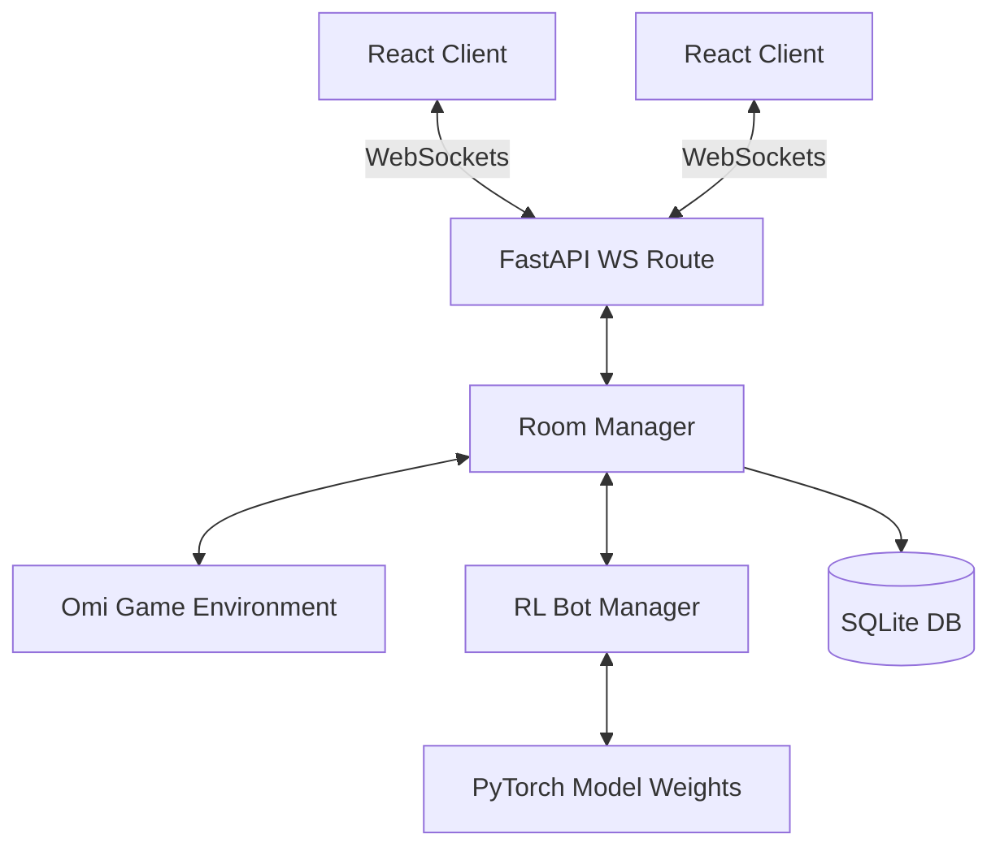

# Omi Web Application

A full-stack real-time multiplayer web app for the traditional trick-taking card game Omi.

The project uses a FastAPI backend as the source of truth for rooms, turns, legal moves, scoring, bots, WebSocket updates, authentication, and match history. The frontend is a React + TypeScript + Vite app styled with Tailwind CSS.

## Features

- Real-time room and game updates over WebSockets
- Server-side rule enforcement for trump selection, turn order, follow-suit rules, trick resolution, and scoring
- Create rooms, join by room code, configure open seats as bots, and start games as host
- Basic account registration/login and user match history
- WebRTC voice-chat signaling through the game WebSocket
- Easy bot fallback that chooses from legal actions

## Current AI Status

The bot integration path exists, but `backend/rl_model/omi_agent.py` is currently a placeholder. Hard mode falls back to legal random play until a trained model loader and weights are added.

## Architecture Overview



## AI State Encoding

The RL model requires a fixed-length numerical observation of the game state. We use an encoding strategy tailored for PettingZoo environments:
- **Observation Space (Length 166)**: Contains one-hot encodings of the agent's hand, current trump suit, lead suit, cards currently in play (up to 4), normalized team scores, and the current player's ID.
- **Action Space (Length 36)**: A discrete space covering all 32 cards plus 4 possible trump suit declarations.
- **Action Masking**: A binary mask of length 36 is enforced during execution to ensure the agent only selects legal actions (like following suit or only declaring trump during the declaration phase).
- **History Vector**: A sequence encoding of up to the last 32 trick plays (player, card, lead, trump) allowing for recurrent policies (LSTMs) if temporal context is required.

## Project Structure

```text
one-last/
  backend/
    app/
      api/          REST endpoints and auth routes
      ai/           bot action selection
      core/         security helpers
      db/           SQLAlchemy database setup and models
      game/         room manager and Omi rules environment
      models/       Pydantic schemas
      ws/           WebSocket connection and socket routes
    rl_model/       AI model integration placeholder
    tests/          backend tests
    requirements.txt
  frontend/
    src/
      hooks/        game state and voice chat hooks
      lib/          API and browser sound helpers
      pages/        app screens
      types/        shared frontend types
    package.json
```

## Run Locally

### Backend

```powershell
cd backend
python -m venv .venv
.\.venv\Scripts\Activate.ps1
pip install -r requirements.txt
uvicorn app.main:app --reload --port 8000
```

### Frontend

```powershell
cd frontend
npm install
npm run dev
```

Open `http://localhost:5173`.

## Environment Variables

Backend:

- `SECRET_KEY`: JWT signing secret. Set this before deployment.
- `DATABASE_URL`: SQLAlchemy database URL. Defaults to `sqlite:///./omi_app.db`.
- `CORS_ORIGINS`: comma-separated allowed origins. Defaults to `http://localhost:5173`.
- `MODEL_PATH`: intended path for trained AI model weights once model loading is implemented.

Frontend:

- `VITE_BACKEND_URL`: backend HTTP URL. Defaults to `http://localhost:8000`.

## API Summary

- `POST /api/auth/register`
- `POST /api/auth/login`
- `GET /api/auth/history`
- `POST /api/lobby/create-room`
- `POST /api/lobby/join-room`
- `GET /api/room/{room_id}?token=...`
- `POST /api/room/{room_id}/configure?token=...`
- `POST /api/room/{room_id}/start?token=...`
- `WS /ws/{room_id}?token=...`

Room snapshots intentionally do not expose player room tokens or host tokens. The frontend receives `is_host`, `viewer_seat_id`, `is_viewer`, and public `peer_id` fields instead.

## Tests

```powershell
cd backend
python -m pytest
```

For the frontend:

```powershell
cd frontend
npm run build
```

## Important Limitations & Future Work

- **In-Memory State**: Active rooms are still stored in process memory within `RoomManager`. They clean up after inactivity, but they are not persisted across server restarts. A planned architectural improvement for horizontal scaling is migrating this active game state to **Redis**.
- Multi-worker or multi-server deployment needs a shared live-state store such as Redis.
- The current AI model file is a placeholder until real training/model loading is added.
- The WebRTC voice path uses a small peer-to-peer mesh. For larger rooms or production reliability, use an SFU.
