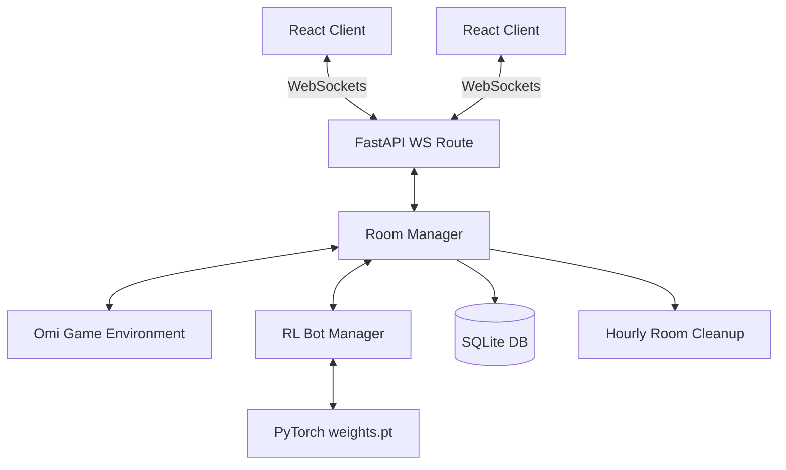

# Omi Web Application — Updated Reference

A full-stack real-time multiplayer web app for the traditional trick-taking card game Omi.

FastAPI backend enforces all game rules server-side. React + TypeScript + Vite frontend styled with Tailwind CSS. Supabase handles authentication (no local register/login endpoints — auth is token-based).

---

## Features

- Real-time room and game updates over WebSockets
- Server-side rule enforcement: trump selection, turn order, follow-suit, trick resolution, scoring
- Round ends as soon as one team wins 5 tricks — remaining cards are not played
- Create rooms, join by room code, configure open seats as bots, start game as host
- Host can swap seat positions before the game starts
- Three bot difficulty slots (`easy`, `medium`, `hard`) — difficulty field is stored but all modes currently use the same inference path (model if weights present, else random)
- Trained RL model loader: drops in a `weights.pt` checkpoint and serves policy inference via PyTorch
- Bot takeover on disconnect: 10-second grace period before a disconnected human seat is replaced by a bot; restored automatically on reconnect
- WebRTC peer-to-peer voice chat signaled through the game WebSocket
- User match history persisted to SQLite and retrievable via API

---

## Architecture Overview



---

## AI State Encoding

> **The old README quoted 166 for the observation length — that was wrong. The correct value is 195.**

### Observation Space — length 195

| Component | Size | Notes |
|---|---|---|
| Hand (card one-hots) | 32 | One bit per card index |
| Trump suit | 4 | One-hot over 4 suits |
| Lead suit | 4 | One-hot; zeros if no trick in progress |
| Current trick (4 × 32) | 128 | Padded to 4 slots with zeros |
| Team scores | 2 | Normalized by `TRICKS_PER_HAND` (8) |
| Player ID | 4 | One-hot (0–3) |
| Suit counts | 4 | Fraction of hand per suit |
| Void matrix (4 × 4) | 16 | Estimated probability each player is void in each suit |
| Hand strength | 1 | Scalar in [0, 1] |
| **Total** | **195** | |

### Action Space — length 36

- Indices 0–31: play a specific card
- Indices 32–35: declare trump suit (C/D/H/S), only legal during trump phase

### History Vector — shape (32, 44)

Sequence of up to 32 past plays. Each row encodes `(player_id, card_idx, lead_suit, trump_suit)` as concatenated one-hot vectors (32 + 4 + 4 + 4 = 44 features). Used by recurrent-compatible policies.

### Action Masking

A binary mask of length 36 is passed with every observation. The policy zeroes out illegal logits before argmax — no illegal card can be selected.

---

## AI Bot Integration

The model loader lives at `backend/rl_model/omi_agent.py`. It is **not a placeholder** — it builds the full PolicyNet architecture and loads a checkpoint on startup.

### Loading a trained model

Place the checkpoint at:

```
backend/rl_model/weights.pt
```

The loader accepts three checkpoint formats:
1. `{"policy_state_dict": <state_dict>}` — output of the `finalwm` training script
2. A bare `state_dict` dict
3. A fully serialized `torch.save(model, ...)` object

If the file is missing, bots fall back to random legal play with a warning in logs.

### Weights path

The path is **hardcoded** to `backend/rl_model/weights.pt` (relative to the `omi_agent.py` file). The `MODEL_PATH` environment variable mentioned in the old README **does not exist in the code** and has no effect.

### PolicyNet architecture

```
obs_encoder:   Linear(195, 128)
hist_encoder:  Linear(1408, 256) → LayerNorm → ReLU → Linear(256, 128) → LayerNorm
core:          Linear(256, 128) → LayerNorm → Tanh → Linear(128, 128) → LayerNorm → Tanh
actor:         Linear(128, 36)
```

History tensor is flattened to 32 × 44 = 1408 before the history encoder.

### Bot difficulty

Three difficulty values are accepted by the configure endpoint: `easy`, `medium`, `hard`. The value is stored on the seat and passed to `BotManager.get_action()`, but the `difficulty` parameter is currently unused — all three modes run the same inference path. Differentiated difficulty behavior is not yet implemented.

---

## Project Structure

```
last/
  backend/
    app/
      api/          REST endpoints (routes.py) and auth history (auth.py)
      ai/           BotManager — wraps OmiAgent for async action selection
      core/         Supabase JWT verification
      db/           SQLAlchemy setup, GameHistory model
      game/         RoomManager, OmiEnv, rules, encoding
      models/       Pydantic schemas
      ws/           WebSocket connection manager and socket routes
    rl_model/
      omi_agent.py  PyTorch model loader and inference
      weights.pt    Trained checkpoint (not committed — add manually)
    tests/
    requirements.txt
  frontend/
    src/
      hooks/        useGameState, useVoiceChat
      lib/          API client, sound helpers
      pages/        Auth, AuthCallback, Game, History, Home, Lobby, Profile, Room, Rules
      types/        Shared TypeScript types
    package.json
```

---

## Run Locally

### Backend

```powershell
cd backend
python -m venv .venv
.\.venv\Scripts\Activate.ps1
pip install -r requirements.txt
uvicorn app.main:app --reload --port 8000
```

### Frontend

```powershell
cd frontend
npm install
npm run dev
```

Open `http://localhost:5173`.

---

## Environment Variables

### Backend

| Variable | Default | Notes |
|---|---|---|
| `SECRET_KEY` | — | JWT signing secret. Required for production. |
| `DATABASE_URL` | `sqlite:///./omi_app.db` | SQLAlchemy database URL |
| `CORS_ORIGINS` | `http://localhost:5173,http://127.0.0.1:5173` | Comma-separated allowed origins |
| `SUPABASE_URL` | — | Supabase project URL for token verification |
| `SUPABASE_KEY` | — | Supabase anon/service key |

> `MODEL_PATH` is **not used**. The weights path is hardcoded — see AI Bot Integration above.

### Frontend

| Variable | Default |
|---|---|
| `VITE_BACKEND_URL` | `http://localhost:8000` |

---

## API Reference

### Auth (prefix: `/api/auth`)

> Authentication uses Supabase. There are no local register or login endpoints. The frontend obtains a Supabase JWT and passes it as a Bearer token or in request bodies.

| Method | Path | Auth | Description |
|---|---|---|---|
| GET | `/api/auth/history` | Bearer token | Paginated match history for the logged-in user (`?limit=50&offset=0`) |

### Lobby & Room

| Method | Path | Auth | Description |
|---|---|---|---|
| POST | `/api/lobby/create-room` | Optional Supabase token in body | Create a room; returns host token + room ID |
| POST | `/api/lobby/join-room` | Optional Supabase token in body | Join by room code; returns seat token |
| GET | `/api/room/{room_id}` | `X-Room-Token` header (optional) | Public room state snapshot |
| POST | `/api/room/{room_id}/configure` | `X-Room-Token` (host only) | Set seat types and bot difficulty |
| POST | `/api/room/{room_id}/swap-seats` | `X-Room-Token` (host only) | Swap two seat positions |
| POST | `/api/room/{room_id}/start` | `X-Room-Token` (host only) | Start the game |

### WebSocket

| Path | Auth | Description |
|---|---|---|
| `WS /ws/{room_id}?token=...` | Room token in query | Game events, actions, WebRTC signaling |

### Utility

| Method | Path | Description |
|---|---|---|
| GET | `/health` | Returns `{"status": "healthy"/"degraded", "db": "ok"/"error"}` |

Room snapshots do not expose player tokens or the host token. The frontend receives `is_host`, `viewer_seat_id`, `is_viewer`, and public `peer_id` fields only.

---

## Frontend Pages

| Page | Route | Description |
|---|---|---|
| `Home` | `/` | Lobby — create or join a room |
| `Auth` | `/auth` | Supabase login/register UI |
| `AuthCallback` | `/auth/callback` | OAuth redirect handler |
| `Lobby` | `/room/:id/lobby` | Pre-game room — seat config, ready-up |
| `Game` | `/room/:id/game` | Active game board |
| `History` | `/history` | User match history |
| `Profile` | `/profile` | User profile |
| `Room` | `/room/:id` | Room router — redirects to lobby or game |
| `Rules` | `/rules` | Game rules reference |

---

## Tests

```powershell
cd backend
python -m pytest
```

```powershell
cd frontend
npm run build
```

---

## Known Limitations & Future Work

- **In-memory room state**: `RoomManager` stores active games in process memory. Rooms are cleaned up hourly for inactivity but are lost on server restart. Migrating to Redis is the planned path for horizontal scaling.
- **Bot difficulty not differentiated**: `easy`, `medium`, and `hard` are wired up in the API but all use the same model inference. Difficulty-tuned behavior (e.g. epsilon-greedy randomness per level) is not yet implemented.
- **Weights not included**: `backend/rl_model/weights.pt` must be added manually. Without it all bots play random legal moves.
- **WebRTC mesh**: Voice chat uses a small peer-to-peer mesh. For larger rooms or production reliability, replace with an SFU (e.g. mediasoup, LiveKit).
- **Single-worker only**: WebSocket connections share in-process state. Multi-worker deployments require a shared live-state store.
